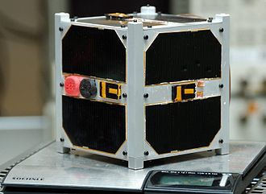

Photo by <a href="https://unsplash.com/@markusspiske?utm_source=unsplash&amp;utm_medium=referral&amp;utm_content=creditCopyText">Markus Spiske</a> on <a href="https://unsplash.com/s/photos/internet?utm_source=unsplash&amp;utm_medium=referral&amp;utm_content=creditCopyText">Unsplash</a>

Ever looked up at the night sky and gasped at how beautiful it is ? Ever thought of owning a telescope and satisfying that urge to explore the cosmos ? Ever lost yourself in the twinkling light of the burning stars ? Ever seen pictures of a night sky that looks as if it has been sprinkled randomly with white paint ? Ever wanted to witness that with your own eyes ?

All these wonders might suffer a setback.

To be honest, I do not know if it will be a serious setback or if it will result in a negligible change but change is sure to come. With the growing needs for internet access rising and the luxury of fast speed Internet access knowing no bounds, technological advancements are inexorable.

**Satellite Constellations**

For improving the quality and reach of the Internet, a genius and very creative idea is that of a satellite constellation.

SpaceX proposed the idea of Starlink. A large group of satellites revolving around the Earth in its lower orbit, providing a high speed, direct broadband connection for the Internet.

Similar projects have been proposed by Samsung and Amazon. SpaceX has already launched a few of the small satellites. It can also lease out some of the satellites to other companies in later stages.

constellation — a group of stars forming a recognizable pattern that is traditionally named after its apparent form or identified with a mythological figure.
a group of associated or similar people or things.
- Google Dictionary

It basically means that thousands of satellites will be launched in an orbit around the Earth to provide broadband Internet access everywhere. This is claimed to not only be useful for underserved areas (in terms of Internet connection) but will also obviously be used to provide internet access to anyone just like any other ISP (Internet Service Provider). This kind of service also promises very high speed internet (around 1 GB/sec) as claimed by SpaceX. Although the idea in itself is noteworthy and intuitive, it is not without its demerits.

<legend>

A faster Internet will have psychological impacts as well but I will not be discussing them here.

<a href="https://en.wikipedia.org/wiki/Psychological_effects_of_Internet_use">https://en.wikipedia.org/wiki/Psychological_effects_of_Internet_use</a>

Feel free to read this Wikipedia article. The title does not mention “Faster Internet” but I do not think that it’s false to assume that an increase in internet speed will consequently result in better internet accessibility and increased consumption of online data.

**Astronomy**
Some scientists and astronomers have spoken against the idea of satellite constellations due to worries regarding light pollution and space debris.

What is light pollution ?

Light pollution is observed by us on Earth at a much smaller scale compared to someone who is looking at distant luminous object through a telescope.

Light pollution is the presence of anthropogenic and artificial light in the night environment. It is exacerbated by excessive, misdirected or obtrusive use of light, but even carefully used light fundamentally alters natural conditions.
-Wikipedia, Light Pollution.

Since satellites are made of metal, they reflect the light coming from the Sun and other luminous objects in space and since they are closer to Earth compared to any star, they shine brighter. The number of satellites in Starlink alone will outnumber stars visible from Earth, so the count of its competitors doesn’t even need to be discussed (but will anyways be discussed later). This causes light pollution and can result in major reading errors in astronomy, which deals with astronomically large and infinitesimally small quantities. Astronomers worldwide have been expressing their concerns.

To be fair, SpaceX acknowledged these concerns and tried different experiments with the satellites including one in which the satellites are covered with an umbrella-shield which stops the Sun’s light from hitting their metal surface. This reduces reflection, but this experiment hasn’t been conducted in large numbers therefore its effectiveness has still not been put to test.

The orbit shifting function of the Starlink satellites is supposed to be autonomous, therefore, no set time or position can be known before the said shift. This prevents astronomers from programming their telescopes to change their positions in sync with the movement of the constellation. Therefore, even if the astronomers want to ignore the light pollution at a certain point in sky, they cannot know where to position their telescopes for the moment.

It will be interesting to see how these companies address this issue but, it simply cannot be ignored. A counter-argument stating that the Earth is just too big and the satellites being used in Starlink and similar projects are small satellites does not address the issue that this is ultimately a business venture, which will inevitably lead to more competition (as history has shown) which, in turn, will increase the number of such satellites. Granted that Earth has a large surface area and also a large orbit-space which can support numerous small satellites but still, it is in the nature of humans (especially capitalists) to keep going as long as they see a way. Only a few stop to note the dangers that their progress poses to the environment. Once the exploitation has reached a dangerous scale, only then steps are taken to reduce the damage already done. By this time, the investments of time, effort and money become a roadblock in large scale rollbacks.

**Space Debris**

This is a major problem because it has the danger of large-scale physical damage. Starlink is said to have 12,000 planned satellites, Oneweb estimated 650 satellites but declared bankruptcy in late March 2020 (source: Wikipedia), Samsung says 4,600 and Amazon plans 3,236 satellites in the decade 2020–2030.

If you see the size of these satellites and compare them to Earth’s, you might call me a fool to consider their debris to be of any harm.

<a href="https://en.wikipedia.org/wiki/File:Estcube-1_2012-12-27.jpg">wikipedia</a>

But, in the lower orbit of Earth, objects travel at a speed of 34,761.83 kmph (21,600mph)! If even a screw hits a satellite glass or telescope lens at that speed, you can be sure that it will cause serious damage. Spacecraft equipment costs billions of dollars to make. Even a small damage can lead to catastrophic failures which needs to be fixed. The cost of making fixes is so high that if these repairs become frequent, it will eventually lead to a major part of research budget going into repairs rather than new missions. This will be a huge drawback for science.

<a href="https://www.theverge.com/2016/5/12/11664668/iss-window-chip-space-debris-tim-peake">Check out the destruction caused by a tiny drop of space debris</a>

Space junk has been constantly increasing and no policy has yet been put forth that can promise an effective management. The speed of objects in orbit plus the humongous cost of space travel and exploration makes it a complex issue which needs serious thought. Before having a good waste management policy, ventures like satellite constellations, which desire to insert tens of thousands of objects in space, should not be undertaken so carelessly.

The perils of improper and unfinished waste management schemes are already being faced by people on the surface of Earth itself, in the form of major land, water and air pollution. These have already resulted in Global Warming, the existence of which is still doubted by many people (although I have different hopes from people venturing into space as they are engineers and scientists themselves and have placed their trust in science).

Space is not anyone’s property and I hope this continues to be the case in the future. But this also means that no one will be willing to take responsibility for clearing the space junk anytime soon.

SpaceX promises a collision avoidance system in their satellites which looks good. Also, they have autonomous propulsion systems in the satellites which will de-orbit these satellites at the end of their life (1–5 years) and the satellites will then burn in the Earth’s atmosphere. These systems provide a compelling argument against the concern of space debris. But these systems haven’t been tested so we will have to wait before we know who was right. Secondly, even though SpaceX has planned these systems, that does not guarantee that their competitors will do so as well. There must be some regulations for these constellations.

SpaceX has previously shown that it cares for the environment with the creation of re-usable rockets. Elon Musk, the CEO of SpaceX, also own Tesla which is a company that not only manufactures electric cars, but has set records that even the traditional petroleum/diesel based cars cannot match. So although this is a good reason to get our hopes up, the future is unknown. It is valid to look at such big ventures with a feeling of doubt and some expectations.

**Surrounded by machines**

This particular disadvantage is purely abstract and I understand that this feeling will not be shared by many, but the thought of surrounding the planet with something artificial makes me a little uncomfortable. I know this feeling will not last long and having thousands of satellites around Earth will be normalized in the future, but for now, it seems like a selfish world.

Human beings will continue progressing and growing and there is nothing wrong in that. But we shouldn’t be allowing ourselves to lose our connection with nature. Deforestation, global warming and pollution are already major issues plaguing Earth and adding more troublesome factors on top of it will just worsen the conditions.

There is also a beauty in the night skies when we walk under them. We can feel it in our body. Our jaw drops in awe when we witness the beauty of the cosmos. With increasing ventures of humans into space, we have begun to lose some of these wonders and we have found more in return. It is true that something man-made can be beautiful too. Maybe in the far future we will be creating satellites that envelop the world in a screen and display something beautiful or maybe create filters for Earth like we do on Instagram which will be festival themed or something still crazier. But nothing beats nature for me. Nature doesn’t pollute. Nature is pure. Humanity isn’t. Perhaps there should be a limit to which we are allowed to change the ways of nature, but then who would know where the limits should lie ? If man creates a life-saving drug but it is something that contradicts the way of nature then should it be done ? Should we be venturing into space to satisfy our undying curiosity knowing that we may bring harm to ourselves and other living beings ? No one knows the right answer. We are just specks in an indifferent universe. Such thought-provoking questions are beyond our comprehension sometimes and only time will tell what the future holds.

